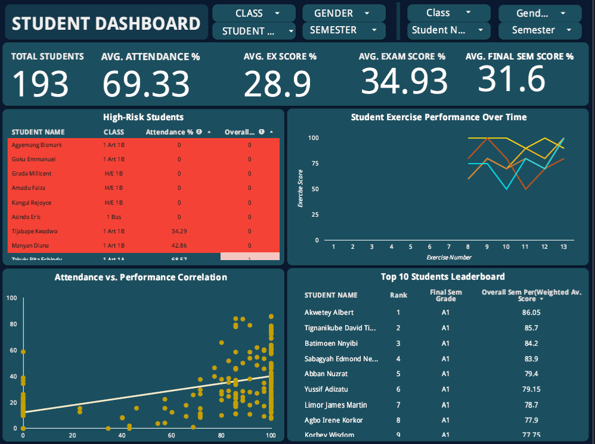

# Student-Performance-Dashboard
The interactive dashboard provides real-time insights into student performance across six classes, covering approximately 200 students. Key metrics include average attendance, exercise scores, examination scores, and overall semester performance. It features a leaderboard for top students, a high-risk student table, a correlation analysis between attendance and performance, and a trend chart tracking academic progress. Designed for dynamic updates, using Google Sheets and Looker Studion, this dashboard enhances data driven decision making in education.

